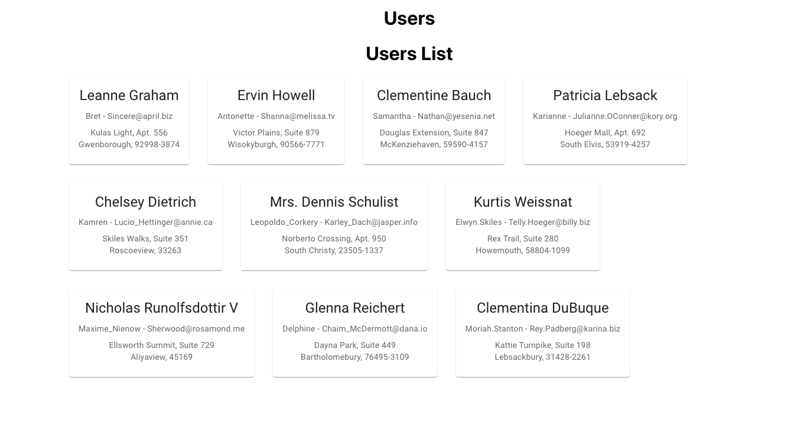

# TYPESCRIPT-REDUX
- This is a project for learning typescript and redux.
- In this project users data is fetched and displayed in a card using API.
 

### API SOURCE
- [JSONPlaceholder](https://jsonplaceholder.typicode.com/users)


### CREATE REACT APP WITH TYPESCRIPT
```shell
npx create-react-app typescript-redux --template typescript
```

### DEPENDENCIES USED
- `npm install react-redux`
- `npm install @reduxjs/toolkit`
- `npm install react-router-dom`
- `npm install @types/react-router-dom`
- `npm install axios`

<br>

For MUI:
- `npm install @mui/material @emotion/react @emotion/styled`
- `npm install @mui/material @mui/styled-engine-sc styled-components`
- `npm install @fontsource/roboto`
- `npm install @mui/icons-material`

<br>

at index.tsx
```shell
import '@fontsource/roboto/300.css';
import '@fontsource/roboto/400.css';
import '@fontsource/roboto/500.css';
import '@fontsource/roboto/700.css';
```
